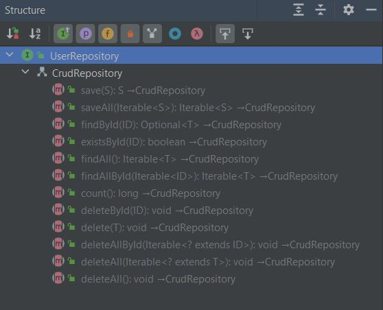
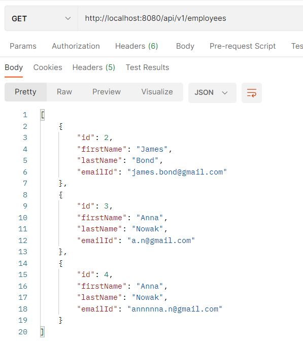
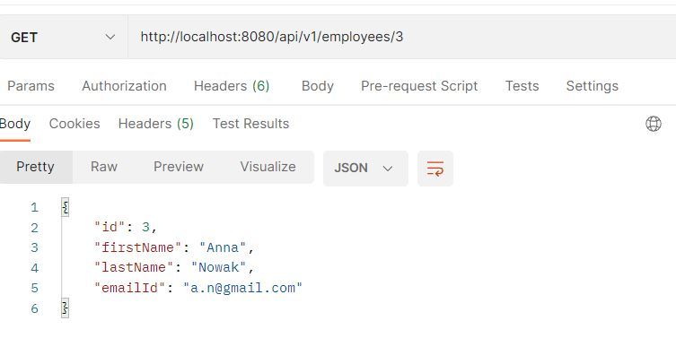
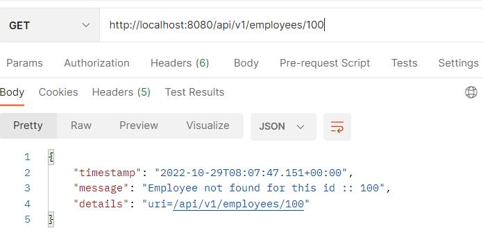
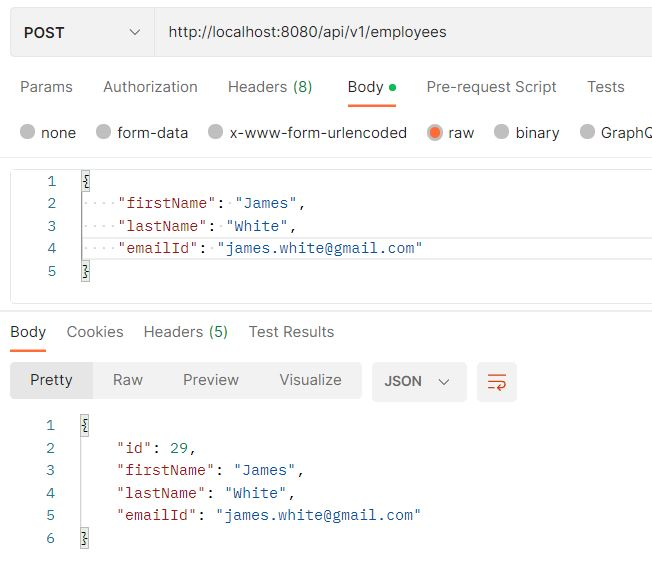
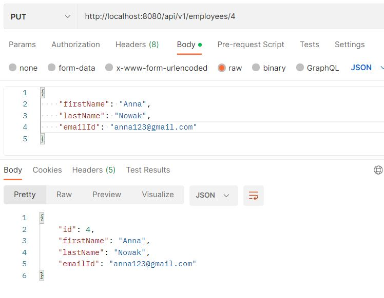
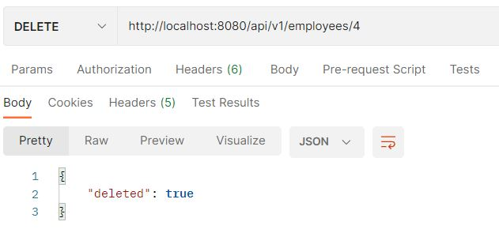
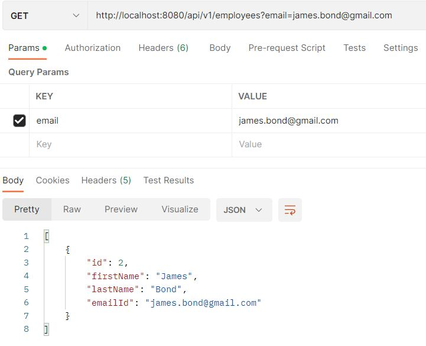
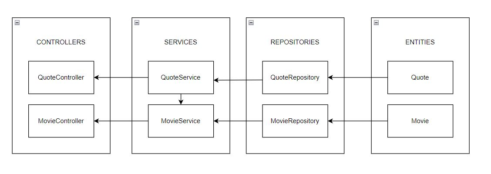

# Lab 3 Multi-layer web applications with Spring Boot

## 3.1 Accessing databases in SpringBoot

Guided [tutorial](https://www.baeldung.com/spring-boot-crud-thymeleaf)


### Questions:

#### 1. The “UserController” class gets an instance of “userRepository” through its constructor; how is this new repository instantiated?
It is instantiated through injection on the property (@Autowired annotation).

#### 2. List the methods invoked in the “userRepository” object by the “UserController”. Where are these methods defined?

Invoked methods:
- save(person)
- findAll()
- findById(id)
- delete(person)

All these methods are inherieted by UserRepository interface from the CrudRepository interface. Here are listed more available methods for userRepository object:



#### 3. Where is the data being saved?
Data is saved in h2database (inmemory database, which means that data will not persist on the disk).

#### 4. Where is the rule for the “not empty” email address defined?
In the Person's entity - annotation @NotBlank is used above the declaration of the field.


## 3.2 Multilayer applications: exposing data with REST interface
Guided [tutorial](https://www.javaguides.net/2018/09/spring-boot-2-jpa-mysql-crud-example.html)

First pull the mysql image:
```
docker pull mysql/mysql-server:5.7
```

Then create and run the container:
```
docker run --name mysql5 -e MYSQL_ROOT_PASSWORD=secret1 -e MYSQL_DATABASE=demo -e MYSQL_USER=demo -e MYSQL_PASSWORD=secret2 -p 33060:3306 -d mysql/mysql-server:5.7
```
Define the database connection properties in `application.properties`:
```
# MySQL
spring.datasource.url=jdbc:mysql://127.0.0.1:33060/demo
spring.datasource.username=demo
spring.datasource.password=secret2
spring.jpa.database-platform=org.hibernate.dialect.MySQL5InnoDBDialect

# Strategy to auto update the schemas (create, create-drop, validate, update)
spring.jpa.hibernate.ddl-auto = update

```

We can create our own exceptions in Spring Boot and define the ResponseStatus using @ResponseStatus annotation. Here is an example:
```
@ResponseStatus(value = HttpStatus.NOT_FOUND)
public class ResourceNotFoundException extends Exception{

    private static final long serialVersionUID = 1L;

    public ResourceNotFoundException(String message){
        super(message);
    }
}
```
We can also customize the error response.

GlobalExceptionHandler class - handles exception-specific and global exceptions in a single place (use annotation @ControllerAdvice)

Adding a method to search an employee by email:
```
Option one:

@GetMapping("/employees")
    public List<Employee> getAllEmployees(){
        return employeeRepository.findAll();
    }

    @GetMapping(value = "/employees", params = "email")
    public List<Employee> getEmployeeByEmail(@RequestParam String email){
        return employeeRepository.findByEmailId(email);
    }


Option two:

@GetMapping(value = "/employees")
    public List<Employee> getEmployeeByEmail(@RequestParam(required = false) String email){
        if(email == null)
            return employeeRepository.findAll();
        return employeeRepository.findByEmailId(email);
    }
```

Testing app with Postman:









## 3.3 Wrapping-up and integrating concepts
The project quote-gererator has now 3 layer architecture:
- Presentation layer/API Layer - user interface of the application that presents the application’s features and data to the user.

- Business/Service layer - contains the business logic that drives the application’s core functionalities. Like making decisions, calculations, evaluations, and processing the data passing between the other two layers.

- Data access object (DAO) layer - responsible for interacting with databases to save and restore application data.


Some created endpoints:

GET http://localhost:9000/api/v1/movies/with-quotes
Lists movies which have at leat one quote
```
[
    {
        "id": 5,
        "title": "Godfather",
        "year": 1986
    },
    {
        "id": 7,
        "title": "La casa de papel",
        "year": 2020
    },
    {
        "id": 16,
        "title": "Forrest gump",
        "year": 1989
    },
    {
        "id": 17,
        "title": "Stranger things",
        "year": 2021
    }
]
```

GET http://localhost:9000/api/v1/quotes/random
Returns completely random quote from a random movie.
```
{
    "id": 23,
    "quote": "I did not even hear what I was screaming, I just wanted to write a damn love letter.",
    "movie": {
        "id": 7,
        "title": "La casa de papel",
        "year": 2020
    }
}
```

GET http://localhost:9000/api/v1/quotes/random?movie=5
Returns random quote from a choosen movie.
```
{
    "id": 21,
    "quote": "Revenge is a dish that tastes best when it is cold.",
    "movie": {
        "id": 5,
        "title": "Godfather",
        "year": 1986
    }
}
```
Or exception when the movie doesn't exist or the movie soesn;t have any quotes:
GET http://localhost:9000/api/v1/quotes/random?movie=15
```
{
    "timestamp": "2022-10-29T08:28:26.697+00:00",
    "message": "There aren't any quotes from movie with id: 15",
    "details": "uri=/api/v1/quotes/random"
}
```


## Review questions

#### A) Explain the differences between the RestController and Controller components used in different parts of this lab.
@RestController is a special controller used in RESTful Web services to handle the requests made by the client (it’s the combination of @Controller and @ResponseBody annotation), while @Controller is used to mark class as Spring MVC Controller and handle web requests.

@RestController is a specialized version of @Controller, when @Controller is a specialization of @Component.

@RestController can't return a view, while @Controller can.

#### B) Create a visualization of the Spring Boot layers (UML diagram or similar), displaying the key abstractions in the solution of 3.3, in particular: entities, repositories, services and REST controllers. Describe the role of the elements modeled in the diagram.


Controllers - responisble for presenting the application’s features and data to the user, handles the HTTP requests and performs authentication (API layer)

Services - business logic of an app, calculations are made there, responsible also for validation and authorization (Business layer)

Repositories - responsible for making CRUD operations (Create, Retrieve, Update, Delete) on a data source (Data access layer)

Entities - represents data that can be persisted to the database (each entity represents a table and each instance is one row in the table)


#### C) Explain the annotations @Table, @Colum, @Id found in the Employee entity.
@Table - specifies the table in the database with which an entity is mapped

@Column - specifies the mapped column for a persistent property or field, it has many attributes which can set the details of the column in the table (for example: "name", "nullabe", "unique")

@Id - specifies the primary key of the entity

#### D) Explain the use of the annotation @AutoWired (in the Rest Controller class).
Annotation @Autowired is used to mark an injection (in this case of the property). At runtime the EmployeeRepository object will be injected into the property employeeRepository (because of @Autowired annotation).

